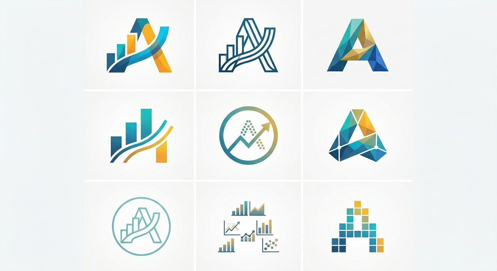

<p align="center">
  
</p>

<p align="center">
  <a href="https://github.com/anyviz/anyviz"></a>
  <a href="LICENSE"></a>
  <a href="SKILL.md"></a>
  <a href="aesthetics/default.json"></a>
  <a href="adapters/web/d3.md"></a>
  <a href="https://github.com/anyviz/anyviz"></a>
</p>

# anyviz

> **anyviz** 是一个面向 AI 时代的高级数据可视化规范与 Skill 库。它为 Claude 等 AI 助手赋予了智能图表选择、黄金美学规范、多技术栈自适应渲染以及多图表设计一致性保障能力，让 AI 能够像专业数据设计师一样创作出令人惊叹的可视化作品。

<p align="center">
  
</p>

---

## 智能可视化流水线

anyviz 通过一个严谨的四阶段工作流来处理所有的可视化请求，确保从数据输入到最终代码生成的每一步都符合专业级的设计标准：

```
                                     anyviz 智能可视化流水线
                                     
 ┌──────────────────────┐      ┌──────────────────────┐      ┌──────────────────────┐      ┌──────────────────────┐
 │   1. 数据与意图分析  │      │   2. 黄金美学规范    │      │   3. 多技术栈自适应  │      │   4. 多图一致性校验  │
 │                      │ ───> │                      │ ───> │                      │ ───> │                      │
 │  • 识别数据特征与维度│      │  • 统一色彩与排版层级│      │  • 检测项目现有依赖  │      │  • 跨图表实体颜色同步│
 │  • 匹配 40+ 种图表决策│      │  • 遵循 Tufte 墨水比 │      │  • 自适应 D3/ECharts │      │  • 校验数值与标注格式│
 └──────────────────────┘      └──────────────────────┘      └──────────────────────┘      └──────────────────────┘
```

---

## 核心特性

| 维度 | 核心特性 | 技术实现与设计标准 |
| :--- | :--- | :--- |
| **智能决策** | **图表智能选择** | 基于数据维度与分析意图（比较、分布、关系、组成、趋势、地理、层次、流程），自动匹配最适合的 40+ 种可视化场景。 |
| **黄金美学** | **数据美学规范** | 汲取 Edward Tufte 与 Nathan Yau 的经典可视化理论，最大化数据墨水比，提供感知均匀、色盲友好的高品质主题。 |
| **自适应** | **多技术栈适配** | 智能感知运行环境。Web 端优先复用 ECharts/Mapbox/Three.js，无依赖时默认 D3.js；Python 端支持 Plotly/Matplotlib；R 端支持 ggplot2。 |
| **一致性** | **多图设计一致性** | 确保同画布下多个图表的字体、字号、边距、网格线、线宽及同实体颜色映射高度统一，内置自动校验工具。 |
| **自然语言** | **无缝定制系统** | 支持“深色主题”、“极简风格”、“适合手机看”等自然语言指令，通过高精度映射矩阵动态覆盖底层美学参数。 |

---

## 快速开始

### 作为 Claude Skill

将此仓库克隆到本地，在与 Claude 的对话中，您可以直接使用自然语言描述您的可视化需求：

```text
帮我可视化这份销售数据
用地图展示各省的人口分布
制作一个仪表盘，展示关键业务指标
把这些图表改成深色主题
```

Claude 会自动加载 `SKILL.md`，并严格按照 anyviz 的四阶段工作流进行处理。

### 作为独立美学库

anyviz 的美学规范采用标准的 JSON 格式定义，可以轻松被其他数据分析工具或脚本引用：

```python
import json

# 加载 anyviz 权威美学规范
with open('aesthetics/default.json', 'r', encoding='utf-8') as f:
    theme = json.load(f)

# 获取分类色板
categorical_palette = theme['color']['categorical']['palette']
print(f"分类色板: {categorical_palette}")

# 获取排版层级
title_font_size = theme['typography']['scale']['h1']['size_px']
print(f"主标题字号: {title_font_size}px")
```

---

## 目录结构

anyviz 采用模块化、高内聚的目录结构，确保规范的清晰性与可扩展性：

```text
anyviz/
├── SKILL.md                     # Claude Skill 主入口（定义 AI 工作流与核心规则）
├── CLAUDE.md                    # Claude 运行时上下文与开发规范
├── aesthetics/                  # 美学规范（权威参数配置来源）
│   ├── default.json             # 默认主题配置（包含颜色、排版、间距、线条、响应式等）
│   ├── color.md                 # 色彩规则与色盲友好色板指南
│   ├── typography.md            # 排版规则与多语言字体适配
│   └── layout.md                # 布局规则与数据墨水比标准
├── guides/                      # 决策与定制指南
│   ├── chart-selection.md       # 图表选择决策树（数据特征 + 意图 → 最佳图表）
│   ├── color-guide.md           # 用色原则与语义颜色约定
│   ├── consistency-rules.md     # 多图表设计一致性校验规则
│   ├── customization-guide.md   # 自然语言到美学参数的完整映射表
│   └── accessibility.md         # 无障碍标准（对比度、色盲友好、冗余编码、alt text）
├── templates/                   # 规范图表模板库（34 种高品质模板）
│   ├── TEMPLATE-SPEC.md         # 模板统一结构规范
│   ├── charts/                  # 统计图表（柱状/折线/散点/直方/箱线/密度/坡度/烛台等 20 种）
│   ├── maps/                    # 地图可视化（面量图、气泡地图、流向地图 3 种）
│   ├── graphs/                  # 关系与层次图（桑基/和弦/力导向/树图/旭日/弧形/冲积等 8 种）
│   └── 3d/                      # 三维可视化（3D地球、3D散点、曲面图 3 种）
├── adapters/                    # 技术栈自适应适配器
│   ├── web/                     # Web 端适配（D3.js、ECharts、Mapbox、Three.js）
│   ├── python/                  # Python 端适配（Plotly、Matplotlib）
│   └── r/                       # R 语言适配（ggplot2）
└── scripts/                     # 工具与校验脚本
    └── theme_validator.py       # 主题一致性自动验证器
```

---

## 核心设计原则

> **1. 美学优先 (Aesthetics First)**
> 最大化数据墨水比（Data-Ink Ratio），坚决消除图表垃圾（Chartjunk）。优先采用直接标注（Direct Labeling）而非依赖繁琐图例，倡导“小倍数图表”（Small Multiples）而非复杂的动画，使数据本身成为视觉的绝对焦点。

> **2. 一致性优于个性化 (Consistency Over Customization)**
> 任何未显式指定的视觉属性均从全局美学规范继承。即使调用者仅定制了单一颜色，字体、间距、线型、网格线等底层属性依然保持严格统一，确保专业级的视觉质感。

> **3. 环境感知自适应 (Environment-Aware Adaptation)**
> 智能感知调用者的开发环境与项目依赖。同一套美学规范在 Web 端、Python 端或 R 语言端均能生成视觉高度一致的输出，打破技术栈之间的视觉壁垒。

> **4. 可解释与可修改性 (Explainable & Modifiable)**
> 每次可视化输出均附带清晰的图表选择理由与美学决策说明。设计决策不应是黑盒，调用者可以轻松理解并根据需要调整任何设计参数。

---

## 核心色板展示

anyviz 默认的 `modern` 主题色板受 Observable Plot 现代设计语言启发，具备极高的高级感与专业度。

<table>
  <thead>
    <tr>
      <th align="left">颜色</th>
      <th align="left">色值</th>
      <th align="left">语义/设计意图</th>
    </tr>
  </thead>
  <tbody>
    <tr>
      <td><span style="color:#4269d0;font-size:1.5em;line-height:1;">●</span></td>
      <td><code>#4269d0</code></td>
      <td>默认主色、主要数据系列、代表稳定与信任</td>
    </tr>
    <tr>
      <td><span style="color:#3ca951;font-size:1.5em;line-height:1;">●</span></td>
      <td><code>#3ca951</code></td>
      <td>次要系列、增长、正面指标、达标状态</td>
    </tr>
    <tr>
      <td><span style="color:#ff725c;font-size:1.5em;line-height:1;">●</span></td>
      <td><code>#ff725c</code></td>
      <td>对比系列、警告、负面指标、亏损状态</td>
    </tr>
    <tr>
      <td><span style="color:#a463f2;font-size:1.5em;line-height:1;">●</span></td>
      <td><code>#a463f2</code></td>
      <td>辅助系列、高亮、特殊对比</td>
    </tr>
    <tr>
      <td><span style="color:#efb118;font-size:1.5em;line-height:1;">●</span></td>
      <td><code>#efb118</code></td>
      <td>辅助系列、注意、预警状态</td>
    </tr>
    <tr>
      <td><span style="color:#6cc5b0;font-size:1.5em;line-height:1;">●</span></td>
      <td><code>#6cc5b0</code></td>
      <td>辅助系列、青色、中性对比</td>
    </tr>
    <tr>
      <td><span style="color:#9696a0;font-size:1.5em;line-height:1;">●</span></td>
      <td><code>#9696a0</code></td>
      <td>中性灰色、背景、参考线、"其他" 类别</td>
    </tr>
    <tr>
      <td><span style="color:#f5a623;font-size:1.5em;line-height:1;">●</span></td>
      <td><code>#f5a623</code></td>
      <td>橙色、高对比度高亮</td>
    </tr>
    <tr>
      <td><span style="color:#ca5bb8;font-size:1.5em;line-height:1;">●</span></td>
      <td><code>#ca5bb8</code></td>
      <td>洋红色、特殊类别对比</td>
    </tr>
    <tr>
      <td><span style="color:#ff8ab7;font-size:1.5em;line-height:1;">●</span></td>
      <td><code>#ff8ab7</code></td>
      <td>粉色、辅助类别对比</td>
    </tr>
  </tbody>
</table>

---

## 技术栈自适应矩阵

anyviz 能够智能解析调用场景与依赖，自动选择最合适的可视化引擎：

| 运行环境 | 默认技术栈 | 适用场景与触发条件 | 核心优势 |
| :--- | :--- | :--- | :--- |
| **Web 前端** | **D3.js** | 默认推荐，无任何外部依赖，适合高度定制化与动态效果。 | 零依赖、像素级控制、无缝集成 |
| **Web 前端** | **ECharts** | 项目中已安装 `echarts` 依赖，或需要开箱即用的美观图表。 | 渲染性能高、开箱即用、交互丰富 |
| **Web 前端** | **Mapbox** | 地理空间数据、高精度的地图可视化场景。 | 专业级地图渲染、支持海量点数据 |
| **Web 前端** | **Three.js** | 三维空间、立体模型、3D 散点或曲面可视化。 | 原生 3D 渲染、硬件加速、沉浸式体验 |
| **Python** | **Plotly** | Jupyter Notebook、交互式数据分析、仪表盘场景。 | 交互性强、支持导出 HTML、语法简洁 |
| **Python** | **Matplotlib** | 学术论文、期刊出版、静态高清晰度打印场景。 | 打印友好、极简克制、符合学术规范 |
| **R 语言** | **ggplot2** | 统计学分析、R 语言生态下的数据可视化。 | 声明式语法、图层叠加、统计图表首选 |

---

## 自然语言定制矩阵

anyviz 支持通过自然语言指令动态覆盖底层美学参数，兼顾定制灵活性与设计一致性：

| 定制维度 | 用户自然语言描述 | 映射美学参数与底层操作 | 预期视觉效果 |
| :--- | :--- | :--- | :--- |
| **整体主题** | "用深色主题" / "暗色模式" | `background.page` = `#1A1A1A`<br>`text.primary` = `#E8E8E8`<br>色板亮度提升 15% | 沉浸式暗色大屏质感，高对比度 |
| **风格倾向** | "学术风格" / "论文风格" | `typography.font_family` = `serif`<br>`stroke.grid.show_y` = `false`<br>保留外边框 | 极简克制，符合学术出版规范 |
| **风格倾向** | "极简风格" / "简洁一些" | `stroke.grid.show_y` = `false`<br>去除所有边框，仅保留核心轴线 | 最大化数据墨水比，去除视觉干扰 |
| **色彩定制** | "用暖色调" | 限制色相区间为 `0° - 60°`（红、橙、黄） | 充满活力、温暖的视觉感受 |
| **色彩定制** | "用冷色调" | 限制色相区间为 `180° - 270°`（青、蓝、紫） | 专业、冷静、科技感的视觉感受 |
| **排版定制** | "字体大一些" | 所有字号层级（H1 - H6）等比例乘以 `1.15` | 提升大屏或高分辨率下的可读性 |
| **布局定制** | "适合手机看" | 自动应用 `mobile` 断点参数<br>宽高比调整为 `1:1` | 适配窄屏，防止图例和标签重叠 |
| **元素定制** | "显示数据标签" | 开启 `data_labels`（字号 `9px`，颜色 `#888888`） | 直接读取精确数值，无需悬停交互 |

---

## 许可

MIT License - 详见 [LICENSE](LICENSE)

---

## 学术与理论参考

anyviz 的设计规范并非凭空产生，而是深深植根于信息可视化领域的经典著作与行业标准中：

*   **Edward Tufte** — *The Visual Display of Quantitative Information* (数据墨水比与消除图表垃圾的奠基理论)
*   **Nathan Yau** — *Data Points: Visualization That Means Something* (数据故事讲述与感知设计指南)
*   **ColorBrewer 2.0** — *Color Advice for Cartography* (感知均匀与色盲友好色板的行业标准)
*   **Viridis** — *Perceptually Uniform Colormaps* (高感知分辨率、打印兼容且色盲友好的多色相色板)
